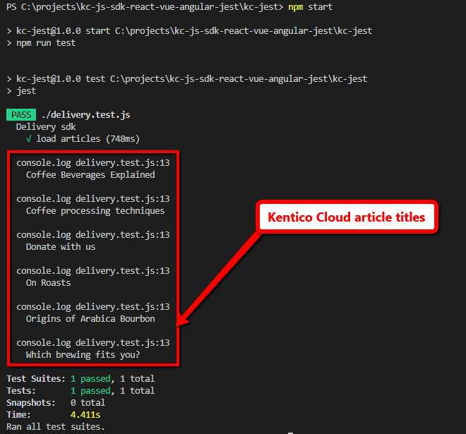
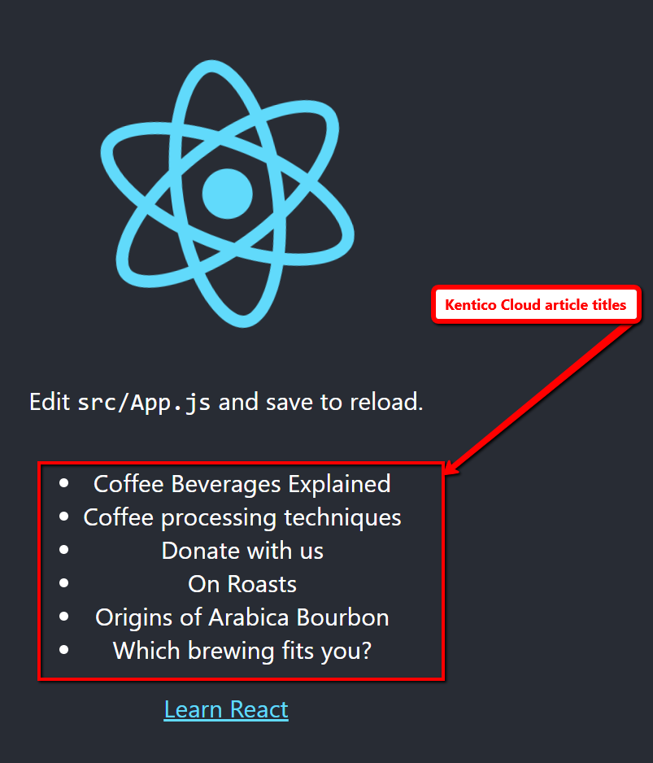
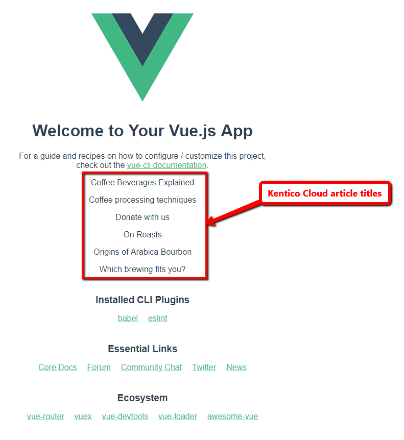
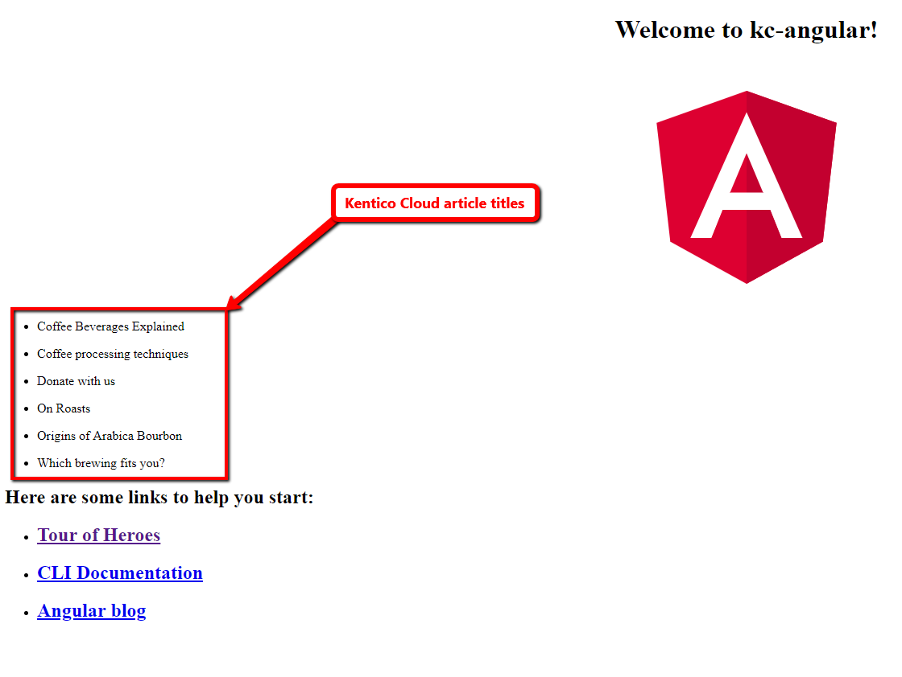

# Kentico Cloud :heart: Jest, React, Vue, and Angular

All of the applications [load the articles](#data-loading) from Kentico Cloud and display its titles in the output.

This repository contains [show cases](#how-does-it-look-like), how does the [Kentico Cloud Delivery SDK](https://github.com/Enngage/kentico-cloud-js/tree/master/packages/delivery) could be used in combination with:

* [Jest](https://jestjs.io) - [Readme](kc-jest/README.md)
* [React](https://reactjs.org) - [Readme](kc-react/README.md)
* [Vue.js](https://vuejs.org) - [Readme](kc-vue/README.md)
* [Angular](https://angular.io/) - [Readme](kc-angular/README.md)

> If you want to take a look in detail - Open the appropriate folder for the description, or click *Readme* link.

## Data loading

Applications are using [Kentico Cloud Delivery SDK for Javascript](https://github.com/Kentico/kentico-cloud-js/blob/master/packages/delivery/DOCS.md) as an [npm package](https://www.npmjs.com/package/kentico-cloud-delivery) to load articles from the sample Kentico Cloud project.

```javascript
import { DeliveryClient } from 'kentico-cloud-delivery';

const client = new DeliveryClient({
  projectId: "975bf280-fd91-488c-994c-2f04416e5ee3"
});

client.items()
  .type("article")
  .getPromise()
  .then(result => {
    console.log(result.items);
  })
```

## How to run

### Common prerequisites

* [node.js](https://nodejs.org) (incl. npm)

For all of the application just navigate to your folder and run

```sh
cd kc-jest # OR cd kc-react OR kc-vue or kc-angular
npm install # to install all the defined dependencies
npm start
```

### How does it look like

#### Jest



#### React



#### Vue



#### Angular

